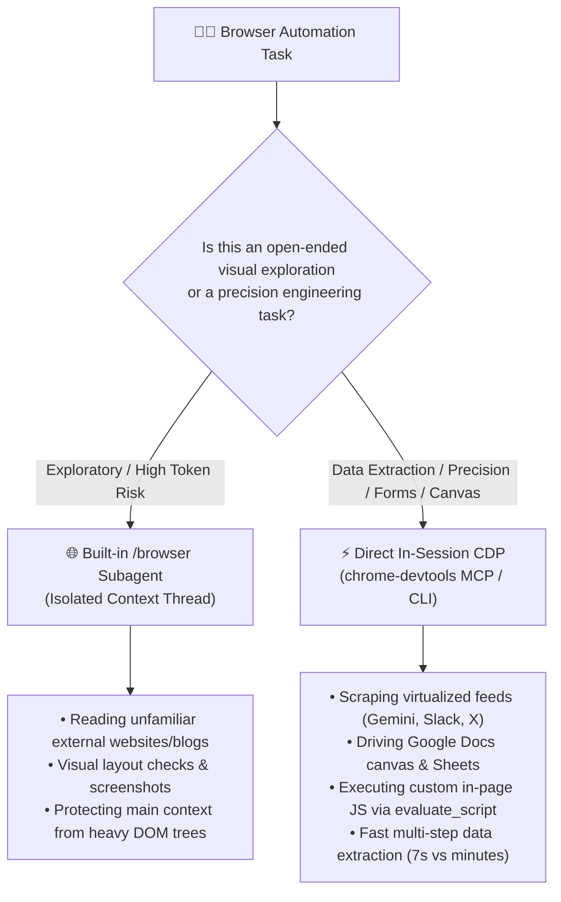

# 🌐 Chrome Dev Control: Live Browser Automation & Diagnostics

This skill is the unified operational guide for inspecting, driving, and repairing connections to the user's live, signed-in **Google Chrome Dev** browser in Antigravity across macOS, Debian Linux, headless Linux devbox, and Windows 11.

---

## 🧭 The Decision Matrix: `/browser` Subagent vs. Direct In-Session CDP

Antigravity provides two distinct paths for browser automation. Choose intentionally based on the task:



### When to Use the Built-in `/browser` Subagent
- **Open-Ended Exploratory Browsing**: Reading unfamiliar documentation, inspecting web articles, or researching external SaaS tools where multi-page DOM trees would needlessly clutter the main conversation history.
- **Visual Smoke Testing**: Verifying frontend layout rendering or capturing screenshots where intermediate steps do not matter.
- **Context Isolation**: Protecting active coding context from hundreds of thousands of accessibility snapshot tokens.

### When to Use Direct In-Session CDP (`chrome-devtools` MCP / CLI)
- **Virtual Scroller & Feed Extraction**: Extracting multi-turn conversations from virtualized DOM containers (e.g. Gemini, Slack, Twitter/X). A visual subagent will miss unrendered off-screen nodes and take 15+ round-trip turns; direct in-session `evaluate_script` executes an asynchronous DOM scroll-and-hydrate loop in Chrome's V8 in milliseconds.
- **Complex Rich Text & Canvas Applications**: Interacting with editors like Google Docs canvas, Notion, or Google Sheets where standard synthetic click/fill events fail.
- **Fast Scriptable Automation**: Executing targeted JavaScript expressions, inspecting `localStorage`/cookies, or interacting with developer APIs directly.
- **Tightly Coupled File/Repo Work**: When browser findings immediately guide local code edits, eliminating the latency and context loss of subagent handoffs.

> [!CAUTION]
> ### ⚠️ The CDP Single-Client Collision Rule
> Chrome DevTools Protocol only allows **one active debugging client per browser process**.
> If the main Antigravity session is currently connected to Chrome Dev via `chrome-devtools-mcp` (e.g. holding port `9222`), spawning `/browser` in a subagent will attempt to open a second connection and fail with `Could not find DevToolsActivePort` or connection refused.
> **Never launch `/browser` while actively executing direct in-session CDP calls.** Choose one approach per task.

---

## 🛠️ Connection Diagnostics & Auto-Repair

Antigravity interacts with Chrome via CDP over port `9222` (or via `DevToolsActivePort`). When browser tools fail, run the diagnostic script bundled with this skill:

```bash
# Read-only health check across display, binary, port file, and CDP reachability
bash <skill-base-dir>/scripts/diagnose.sh

# Automatically apply the detected platform repair:
bash <skill-base-dir>/scripts/diagnose.sh --fix
```

### 🧭 Cross-Platform Root Cause & Repair Matrix

| Machine / OS | Environment | Chrome Type | Root Cause of Failure | 1-Step Repair (`--fix`) |
|---|---|---|---|---|
| **macOS** *(Work Mac)* | GUI Desktop | `Google Chrome Dev.app` | Port file written to `Google Chrome Dev/`, but tools expect `Google/Chrome/` | Symlink `Google Chrome Dev` port to `Google/Chrome` |
| **Debian Desktop** | GUI Desktop | Flatpak `com.google.ChromeDev` | Profile isolated in `~/.var/app/...`, tools check `~/.config/` | Symlink Flatpak profile to `~/.config/google-chrome-unstable` |
| **ByteDance Devbox** | Headless Linux VM | Native deb package | No graphical display (`$DISPLAY` unset); Chrome never runs by default | Launch headless Chrome daemon with ephemeral debugging port |
| **Windows 11** | GUI Desktop | `chrome.exe` (Dev) | Tool subprocess exit terminates ephemeral CDP sockets | Start persistent background daemon (`chrome-devtools start`) |

---

## ⚡ Interface 1: Native Antigravity MCP Tools (In-Session)

The `chrome-devtools` server is configured in `~/.gemini/config/mcp_config.json`. When active, invoke tools directly using `call_mcp_tool`:

```json
call_mcp_tool(
  ServerName="chrome-devtools",
  ToolName="list_pages",
  Arguments={}
)
```

### Essential Tool Reference

| Tool | Key Arguments | Purpose |
|---|---|---|
| `list_pages` | `{}` | Lists all open tabs, page IDs, URLs, and titles. |
| `select_page` | `{"pageId": 1}` | Selects target tab for context-sensitive operations. |
| `new_page` | `{"url": "https://..."}` | Opens a new tab and navigates to the URL. |
| `close_page` | `{"pageId": 3}` | Closes specified tab. |
| `navigate_page` | `{"pageId": 1, "url": "https://...", "type": "url"}` | Navigates or reloads (`type`: `url`, `reload`, `back`, `forward`). |
| `evaluate_script` | `{"pageId": 1, "function": "() => document.title"}` | Evaluates JavaScript in page and returns serialized JSON. |
| `take_snapshot` | `{"pageId": 1}` | Returns text-based accessibility tree with element `uid`s (prefer over screenshots). |
| `click` | `{"pageId": 1, "uid": "2_5"}` | Clicks element by its snapshot `uid`. |
| `fill` | `{"pageId": 1, "uid": "2_7", "value": "text"}` | Enters text into an input/textarea or selects an option. |
| `type_text` | `{"pageId": 1, "text": "hello"}` | Types text into currently focused element via synthetic keyboard events. |
| `press_key` | `{"pageId": 1, "key": "Enter"}` | Sends specific key presses (`Enter`, `Escape`, `Tab`, `ArrowDown`). |

> [!IMPORTANT]
> **`evaluate_script` File Path Restriction**: When saving output to disk via `filePath`, the target path **must reside inside the active workspace root** (e.g. `/Users/bytedance/ai-conversations/temp.json`). Paths outside the workspace root (such as `.gemini/antigravity-cli/brain/`) will be rejected with an access-denied error.

### Pattern: Scraping Virtualized Containers in V8
When extracting long conversations or dynamic feeds where DOM nodes are recycled:
```javascript
async () => {
  const container = document.querySelector('infinite-scroller, .chat-history');
  container.scrollTop = 0; // Load earliest messages
  await new Promise(r => setTimeout(r, 1000));
  
  const items = Array.from(document.querySelectorAll('user-query, model-response'));
  const extracted = [];
  
  for (const item of items) {
    item.scrollIntoView({ block: 'center' }); // Force virtual DOM hydration
    await new Promise(r => setTimeout(r, 150));
    
    // Clean preview headers/aria noise
    const clone = item.cloneNode(true);
    clone.querySelectorAll('.cdk-visually-hidden, h5, .screen-reader-user-query-label').forEach(el => el.remove());
    extracted.push(clone.innerText.trim());
  }
  return extracted;
}
```

---

## 💻 Interface 2: `chrome-devtools` CLI (Shell & Scripting)

The CLI binary (`chrome-devtools`) is available globally via Node/Bun:
- **macOS**: `/opt/homebrew/bin/chrome-devtools`
- **Linux**: `~/.npm-global/bin/chrome-devtools`
- **Windows**: `%USERPROFILE%\.bun\bin\chrome-devtools.exe`

### Daemon Commands
- **Check Status**: `chrome-devtools status`
- **Start Persistent Daemon**: `chrome-devtools start --autoConnect --channel=dev`
- **Stop Daemon**: `chrome-devtools stop`

### ⚠️ Critical CLI Syntax Rules
In the CLI, **required arguments must be positional**; optional settings use `--flags`:
- **Take snapshot**: `chrome-devtools take_snapshot 1`
- **Click element**: `chrome-devtools click 1 "2_5"`
- **Fill input**: `chrome-devtools fill 1 "2_7" "search query"`
- **Evaluate JS**: `chrome-devtools evaluate_script "() => document.title" --pageId 1`
- **Incorrect (will fail)**: `chrome-devtools click --pageId 1 --uid "2_5"`

---

## 📋 Complex Automation Playbooks

### 1. Google OAuth & "Unverified App" Bypass
When authenticating local CLI tools (`gws`, local relays):
1. **Select Account**: Snapshot and click `link "<Name> <email>"`.
2. **"Google hasn’t verified this app" Warning**:
   - Snapshot and find `link "Advanced"`. Click it.
   - Snapshot again and click `link "Go to <App Name> (unsafe)"`.
3. **Permissions Screen**:
   - Snapshot and locate `checkbox "Select all"`. Click it.
   - Verify all needed scopes are checked, then click `button "Continue"`.
4. Close the browser tab once callback redirection finishes.

### 2. Google Docs Canvas & Rich Editors
- Google Docs renders document text on an HTML5 canvas. Standard `fill` commands on canvas elements will fail.
- **Best Practice**: Use Google Workspace APIs (`gws docs`) for reading and writing document bodies.
- **Browser-Only Actions**: Use browser automation strictly for UI actions that lack API support (e.g. embedding live Sheets charts: Insert → Chart → From Sheets). Focus the element and use `press_key` or `type_text` instead of `fill`.
